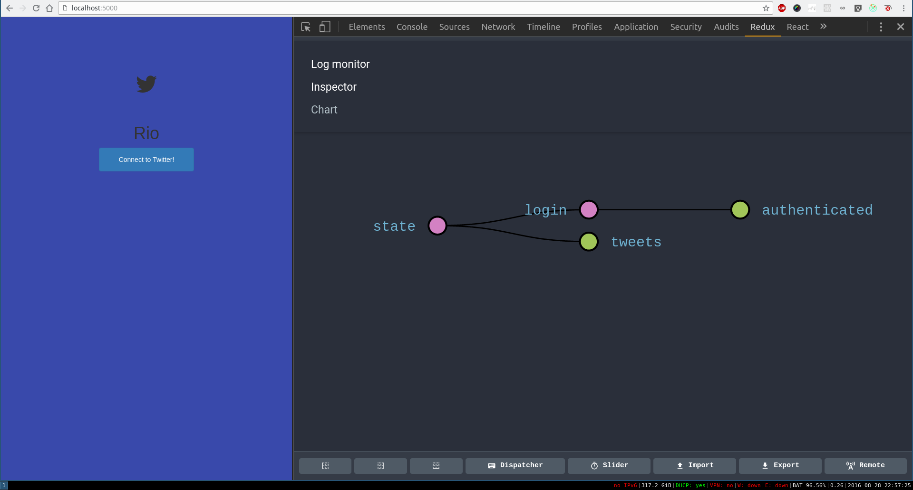
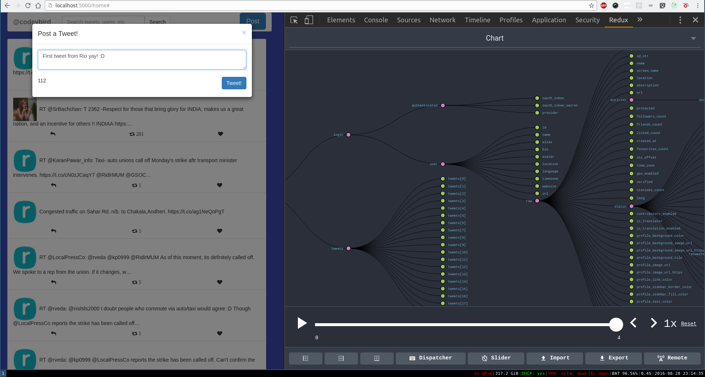

# Rio - Just another Twitter web client (as a SPA) based on React and Redux.







How to Run:
```
git clone https://github.com/creativcoder/rio

npm install

npm run serve

```


Overview (In progress):

Although Rio being a single page app, we do have two high level divsions here using `react-router`.

+ Login Screen (Authenticate with twitter and get Oauth credentials)

+ Dashboard Screen (Depicts the home screen of Rio, showing a tweetbox, list of tweets, a navbar, settings etc)

and will consist of the following major ContainerComponents along with their PresentationalComponents (likely to extend as we develop further):
```
+ LoginComponent - Responsible for OAuth login and getting access tokens.

+ RiolayoutComponent - Base container for all other components within the main home screen of Rio.
   |--NavbarComponent - Navigation bar for searching tweets and logout.
   |--TweetlistComponent - Shows list of tweets from users feed.
   |--TweetboxComponent - To post a new tweet.
   |--TweetComponent - Represents a single tweet, with buttons like (fav, retweet, reply, message)
```

NOTE: This readme will be updated to include the actions creators, reducers that these components will generate as well as the global state structure when the Rio's architecture is well defined.
